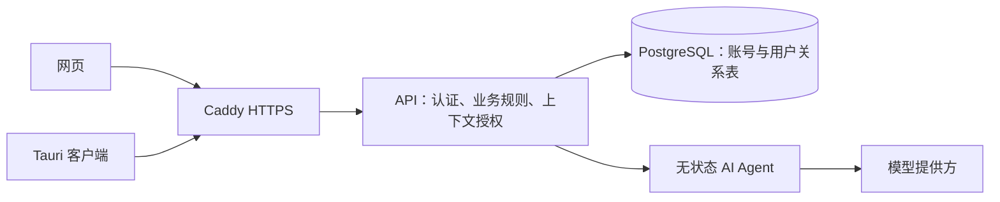

# 架构

当前生产结构：React Web / Tauri → Rust API → PostgreSQL；Rust API → 独立 AI Agent → 模型提供方。完整配置与运行边界见 [自建部署](self-hosting.md)。

- `client/src/api.ts` 是统一 HTTP 客户端；`lib/service.ts` 管理服务器地址、已展示版本。前端不依赖桌面 sidecar 或数据库实现。
- `server/src/hosted.rs` 根据服务端会话选择用户数据库，执行版本检查、数据库 advisory lock、导出和导入。用户请求不能指定租户。
- `server/src/accounts.rs` 管理 Argon2 密码、随机会话及撤销、注册邀请码和登录限速。会话在数据库仅保存哈希。
- `server/src/db/` 保留领域仓储和事务校验；`storage.rs` 隔离 SQL 引擎。PostgreSQL 保存关系表，SQLite 仅用于旧文件迁移和本地开发回归。
- `server/src/agent.rs` 定义冻结上下文的执行接口，可连接独立进程或在本地开发内联执行。工作流、Provider、输出验证仍在 `server/src/ai/`，其代码不调用仓储。
- `server/src/secrets.rs` 在托管模式用主密钥加密用户凭据，AAD 包含用户 schema 和密钥用途；本地开发兼容系统钥匙串。

账号使用独立 PostgreSQL schema，而不是共用单用户 AppState。每个请求只持有已认证用户的连接；连接关闭即释放任何未显式释放的会话锁。业务写入和数据版本在同一事务推进，避免应用崩溃造成“数据已变而版本未变”。多个 API 实例使用同一数据库锁，客户端旧版本写入返回 409。

AI 分析准备阶段读取并冻结用户授权的数据；外部模型工作期间释放账户锁，避免长时间阻塞其他设备。结果保留输入版本与分析轨迹，随后通过 API 写入分析历史。独立 Agent 的 Compose 服务既没有数据库连接信息，也不在数据库网络。

当前同步是在线版本检查及按需刷新，没有离线写入队列、实时推送或持久 AI 作业队列。连接按请求创建，业务请求并发有上限；此实现面向小规模自建，进一步扩大并发应增加连接池、分页/增量资源接口和任务队列。
